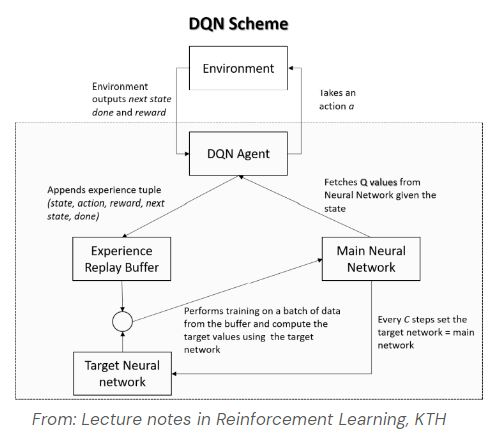

# Reinforcement Learning Challenge
## Learning in the Platform Domain

Code for training and evaluating an agent on the [Platform Domain](https://github.com/cycraig/gym-platform).

The repository consists on scripts for training a DQN agent, and a colab notebook used for training ray rllib agents.

## Learning environment


The Platform environment [[Masson et al. 2016]](https://arxiv.org/abs/1509.01644) uses a parameterised action space and continuous state space. The task involves an agent learning to avoid enemies and traverse across platforms to reach a goal. Three actions are available to the agent:

- run(dx)
- hop(dx)
- leap(dx)

A dense reward is given to the agent based on the distance it travels. The cumulative return is normalised to 1, achieved by reaching the goal. An episode terminates if the agent touches an enemy or falls into a gap between platforms. 

## Dependencies

This repository requires to install the gym platform environment. This can be done by
```
pip install -e git+https://github.com/cycraig/gym-platform#egg=gym_platform
```

and by having the required dependencies:
- gym 0.25.2 (more recent versions create conflicts when using custom models and preprocessors with ray rllib)
- torch 1.6.0
- matplotlib 3.4.3
- numpy 1.23.4

If using Weighs&Biases for experiment tracking (I did! (sometimes)), then also
- wandb

If using the colab for training ray rllib agents, the imports are done in the colab.
If there are problems initializing the environment using *gym.make()*, register the environment using the *register_env* function in *ray.tune.registry*.

## Repository structure
The repository is organized as follows:
- ***DQN_agent***: Defines the DQN agents
- ***Experience***: Defines the experience replay buffer 
- ***Evaluator***: Extra function for evaluating an agent
- ***Networks***: Defines the torch models used as approximators for the agent
- ***Config***: Configuration file (see configuration file section)
- ***extend_platform***:  Extension of the platform environment class that returns rbg arrays of intermediate states in the info dictionary (for plotting)
- ***plotters***: Utilities for plotting and creating gifs / videos showcasing the agent
- ***preprocessors***: Preprocessor classes used to transform the observations and actions (to make them env-friendly, or model-friendly)
- ***train***: Main file used here. It defines the training and evaluation, and calls plotting
- ***train_ray_agent***: Notebook for training a ray rllib agent (default: PPO)
- ***utils***: Some utilities 

## Example usage
Change the ***config.json*** file and then run the ***train.py*** file.

## Config file
The config file is a bit messy and should be definitely modified to contain all the parameters "in the right place".
### Modes
The modes specify the "mode" in which we want to run the program. 
- *wandb_mode*: If True, it initialize weights and biases for experiment tracking. Recommended: set it to False.
- *save_mode*: Whether to save checkpoints for the models
- *plot_mode*: Whether to plot the training / evaluation progress at the end of training
- *observation_mode*: Whether to load a trained agent and create a gif from it. If True, no training would be made. Change the pathfile of the checkpoint inside the ***train.py*** script.
- *play_mode*: Mode that allows to "play" the game by giving the chosen action as integer. Useful for understanding the preprocessing (indeed, I spotted a big error this way!)
- *seed_mode*: Set a fixed seed for reproducibility.

### Parameters
- *N_episodes* : Number of episodes for which to train the agent
- *discount_factor* : Discount factor (close to 1 to not prioritize immediate rewards, lower to prioritize immediate rewards)
- *n_ep_running_average* : Smoothing factor for plotting (shouldn't be in here!!)
- *n_discretization* : Number for which to discretize the intensity for each action
- *no_steps* : Whether to let the agent observe the number of steps of the player or not
- *dim_state* : Dimensionality of the observation state (always 9. If the steps are observed, this is taken into account int the script)
- *eval_episodes* : Number of episodes in the evaluation phase
- *eval_every* : When the evaluation is taking place (every *eval_every* iterations)
- *hidden_size_1* : Hidden size of the first layer of the network
- *hidden_size_2* : Hidden size of the second layer of the network

### Hyperparameters

- *N* : Batch size
- *C*: Number indicating when to update the target network
- *N_buffer* : Size of the experience replay buffer
- *lr* : Learning rate
- *e_min* : Minimum epsilon
- *e_max* : Maximum epsilon
- *CER* : Combined Experience Replay. Whether to add the last experience in the batch
- *exponential_decay* : Whether to decay the epsilon exponentially (if not, it decays linearly)
- *experimental_power_reward* : EXPERIMENTAL. It sets reward to reward^3

### Display parameters
Unused

# Project description

We want to find an agent (a “player”) that learns how to play a game given as the Platform environment.

## What will I try to do?
- Understand the problem setting
- Choose a RL algorithm and implement it
- Find appropriate hyperparameters
- Understand the trained agent’s decisions

## Setting and limitations
. I had not used Reinforcement Learning libraries before
- Not much experienced in RL implementation (one academic course with some labs)
- Not comfortable with SOTA algorithms (prefer “simple” ones)
- Personal laptop not working properly 

## What do I do?

I implement a [PPO algorithm](https://openai.com/blog/openai-baselines-ppo/) using [rllib library](https://docs.ray.io/en/latest/rllib/index.html) (in the notebook *train_ray_agent*), which achieves nearly perfect score (reward 0.999).

I then decide to construct my own [DQN algorithm](https://paperswithcode.com/method/dqn) implementation, which is simpler, but would gave me a better control of the environment and model, and allow me to define a simpler explainability pipeline.
I also use [Combined Experience Replay](https://paperswithcode.com/method/dqn) and [Dueling Networks](https://arxiv.org/abs/1511.06581).



## Discretizing the action space
The action space is continuous, since the intensity of the actions is a continuous (float) variable. This makes it more difficult to learn an agent.
To solve this, I decide to dicretize the intensity of the actions with equally distributed bins. The number of bins would be defined by *n_discretization*.

## Discretizing the observation space
The observation of the state contains an observation on the number of steps done.
The information of the step could be redundant (otherwise the player could “”memorize”” a policy; playing blindfolded). We choose whether to give this information to the network or not, via the *no_steps* variable.

## Training
Training with the default configurations. We achieve a 100% winning rate after 1500 iterations.


## Hyperparameter tuning
Some violin plots of the hyperparameter tuning, where each hyperparameters have been tried on 15 different random initializations. 


## Explainability
In this explainability pipeline, we use saliency maps. In the top, the agent player is shown. In the botom left, the distribution of the approximated Q values (the greater is the Q value for an action, the "better" is to take that action, according to the approximated reward.
In the bottom right, the distribution of the saliency map for the best action is shown. The greater is the value for a particular observation, the more that observation has been used to decide to take that action.


